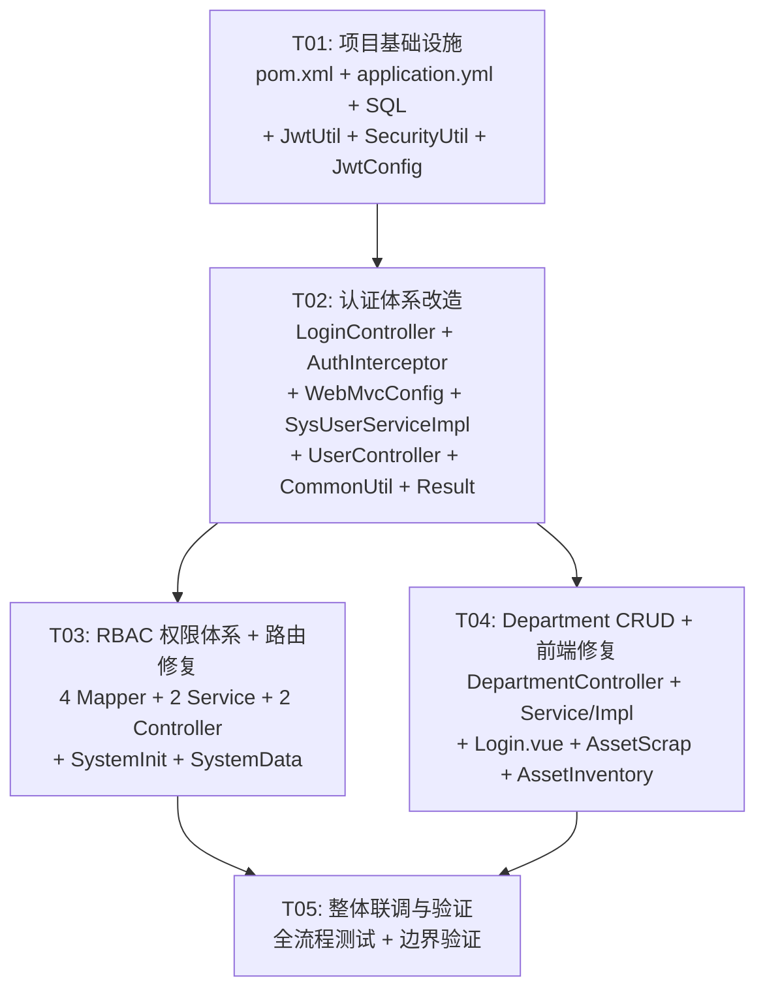

# IT 固定资产管理系统 — 系统设计文档

> **设计人**：Bob（Architect）  
> **日期**：2025-07-15  
> **上游输入**：PRD（P0 安全高危修复 + RBAC 权限体系 + 功能缺陷补全）

---

## 目录

1. [Part A：系统设计](#part-a系统设计)
   - [1. 实现方案](#1-实现方案)
   - [2. 文件列表](#2-文件列表)
   - [3. 数据结构与接口](#3-数据结构与接口)
   - [4. 程序调用流程](#4-程序调用流程)
   - [5. 待明确事项](#5-待明确事项)
2. [Part B：任务分解](#part-b任务分解)
   - [6. 依赖包列表](#6-依赖包列表)
   - [7. 任务列表](#7-任务列表)
   - [8. 共享知识](#8-共享知识)
   - [9. 任务依赖图](#9-任务依赖图)

---

## Part A：系统设计

### 1. 实现方案

#### 1.1 核心难点分析

| 难点 | 现状 | 解决思路 |
|------|------|----------|
| Token 无签名可伪造 | `"token-" + userId + "-" + timestamp` | 替换为 JWT（HMAC-SHA256 签名） |
| 密码 MD5 可彩虹表破解 | `MD5(password)` 存储 | 迁移到 BCrypt（自动加盐，cost=10） |
| 无认证拦截器 | /system/* 裸奔 | 新增 HandlerInterceptor，拦截除 /login 外的所有 /asset/* 请求 |
| RBAC 表定义但无实现 | 4 个 Entity 只有空壳 | 新增 Mapper/Service/Controller + 建表 SQL |
| 路由冲突 | 两个 Controller 都 `@RequestMapping("/system")` | SystemInitController → `/system-init`，SystemDataController → `/system-data` |
| 数据库密码硬编码 | `password: CHNX#000` | 改为 `${DB_PASSWORD:CHNX#000}`（环境变量 + 默认值兜底） |

#### 1.2 技术选型

##### JWT 方案

**选择：jjwt（io.jsonwebtoken）0.11.5**

| 对比维度 | jjwt 0.11.5 | nimbus-jose-jwt |
|----------|------------|-----------------|
| 包大小 | ~300 KB（jjwt-api + impl + jackson） | ~800 KB |
| API 简洁度 | 链式调用，极简 | 较复杂，需理解 JOSE 规范 |
| Spring Boot 2.7 兼容 | ✅ 完全兼容（JDK 17） | ✅ 兼容 |
| 社区活跃度 | ⭐⭐⭐⭐⭐ | ⭐⭐⭐⭐ |
| 适用场景 | 简单 Token 签发/验证 | 完整 OAuth2/OIDC |

**结论**：本项目仅需 Token 签发与验证，jjwt 的 Builder → sign → parse → verify 链式 API 足够简洁，无需引入 nimbus 的完整 JOSE 体系。

**JWT 结构设计**：

```
Header:  {"alg": "HS256", "typ": "JWT"}
Payload: {
  "sub": "1",           // userId（主题）
  "username": "admin",  // 用户名
  "role": 2,            // 角色（1-普通 2-管理）
  "iat": 1715788800,    // 签发时间
  "exp": 1715875200     // 过期时间（24h）
}
Signature: HMAC-SHA256(base64UrlEncode(header) + "." + base64UrlEncode(payload), secret)
```

**密钥管理**：签名密钥从 `application.yml` 的 `jwt.secret` 读取，默认值 `it-asset-system-jwt-secret-key-2024`，生产环境通过环境变量 `JWT_SECRET` 覆盖。

##### BCrypt 方案

**选择：spring-security-crypto（仅 crypto 模块，不引入完整 Spring Security）**

引入最小依赖：
```xml
<dependency>
    <groupId>org.springframework.security</groupId>
    <artifactId>spring-security-crypto</artifactId>
</dependency>
```

- **不引入** `spring-boot-starter-security`（会全局拦截请求，破坏现有架构）
- 仅使用 `BCryptPasswordEncoder`（cost=10，每次哈希 ~100ms）
- 在 `SysUserServiceImpl` 中注入单例 Bean

##### 密码迁移策略

现有 admin 用户密码为 MD5 哈希。采用**渐进式迁移**：

```
login(username, password):
  1. user = findByUsername(username)
  2. if BCrypt.matches(password, user.password) → 登录成功
  3. else if MD5(password) == user.password → 登录成功 + 自动升级(BCrypt)
  4. else → 登录失败
```

第 3 步自动将密码字段更新为 BCrypt 哈希，实现零停机迁移。

##### RBAC 设计思路

**策略：保留现有 `SysUser.role` 字段 + 新建完整 RBAC 表**

| 方式 | 优点 | 缺点 |
|------|------|------|
| 完全迁移到 RBAC | 灵活，可扩展 | 改动大，需改所有 role 判断逻辑 |
| 完全保留 role 字段 | 改动小 | 无法支持细粒度权限 |
| **混合模式（选用）** | 兼容现有逻辑，同时建设 RBAC 基础设施 | 两套判断逻辑需同步 |

**实施路径**：
1. JWT payload 中携带 `role` 字段（来源：`SysUser.role`），用于快速角色判断
2. 新建 4 张 RBAC 表并预置数据：`管理员`（role_code=ADMIN）、`普通用户`（role_code=USER）
3. `sys_user_role` 表插入对应关系（现有 admin → 管理员角色）
4. 后端拦截器从 JWT 解析 role，写入 request attribute，Controller 按需检查
5. 前端 `localStorage.getItem('role')` 判断角色，`v-if="userRole === 2"` 控制按钮

**数据初始化 SQL**：
```sql
-- 角色
INSERT INTO sys_role (role_name, role_code, description, status) VALUES
('管理员', 'ADMIN', '系统管理员，拥有所有权限', 1),
('普通用户', 'USER', '普通用户，基础操作权限', 1);

-- 用户-角色关联（现有 admin 用户 userId=1）
INSERT INTO sys_user_role (user_id, role_id) VALUES (1, 1);
```

#### 1.3 架构模式

继续使用现有分层架构（Controller → Service → Mapper），不做架构调整。认证拦截器作为横切关注点，通过 Spring HandlerInterceptor 实现。

---

### 2. 文件列表

> 根路径：`E:/固定资产系统/`

#### 2.1 后端新增文件

```
it-asset-system/src/main/java/com/asset/itassetsystem/
├── config/
│   ├── JwtConfig.java              # JWT 配置属性类（@ConfigurationProperties）
│   └── WebMvcConfig.java           # Web MVC 配置（注册 AuthInterceptor）
├── interceptor/
│   └── AuthInterceptor.java        # 认证拦截器（Token 验证）
├── util/
│   ├── JwtUtil.java                # JWT 工具类（签发/验证/解析）
│   └── SecurityUtil.java           # 安全工具类（BCrypt 哈希/验证）
├── mapper/
│   ├── SysRoleMapper.java          # 角色 Mapper
│   ├── SysPermissionMapper.java    # 权限 Mapper
│   ├── SysUserRoleMapper.java      # 用户-角色关联 Mapper
│   └── SysRolePermissionMapper.java # 角色-权限关联 Mapper
├── Service/
│   ├── SysRoleService.java         # 角色服务接口
│   └── SysPermissionService.java   # 权限服务接口
├── Service/impl/
│   ├── SysRoleServiceImpl.java     # 角色服务实现
│   └── SysPermissionServiceImpl.java # 权限服务实现
└── Controller/
    ├── RoleController.java         # 角色管理控制器
    └── PermissionController.java   # 权限管理控制器
```

#### 2.2 后端修改文件

```
it-asset-system/
├── pom.xml                                          # 新增 jjwt、spring-security-crypto 依赖
├── src/main/resources/
│   ├── application.yml                              # DB 密码改为环境变量；新增 jwt 配置
│   └── db/migration/
│       └── V1__init_rbac.sql                        # 建表 + 初始数据（新建）
└── src/main/java/com/asset/itassetsystem/
    ├── common/
    │   ├── CommonUtil.java                          # 移除旧 token 解析方法，新增 JWT 解析
    │   └── Result.java                              # 新增 code=401 快捷构造方法
    ├── config/
    │   └── CorsConfig.java                          # allowedHeaders 显式加 "token"（兼容前端）
    ├── Controller/
    │   ├── LoginController.java                     # JWT 签发 + BCrypt 验证
    │   ├── UserController.java                      # MD5 → BCrypt（reset-password、create）
    │   ├── DepartmentController.java                # 补全 save/update/delete/detail
    │   ├── SystemInitController.java                # @RequestMapping("/system") → "/system-init"
    │   └── SystemDataController.java                # @RequestMapping("/system") → "/system-data"
    ├── Service/
    │   ├── SysUserService.java                      # login 方法签名调整（返回含角色信息）
    │   └── SysDepartmentService.java                # 新增 save/update/delete/detail 方法
    └── Service/impl/
        ├── SysUserServiceImpl.java                  # MD5 → BCrypt 迁移逻辑
        └── SysDepartmentServiceImpl.java            # CRUD 实现
```

#### 2.3 前端修改文件

```
it-asset-frontend/src/
├── views/
│   ├── Login.vue              # prefix-icon="User" → <el-icon><User /></el-icon>
│   ├── AssetScrap.vue         # 审批按钮加 v-if="userRole === 2"
│   └── AssetInventory.vue    # 管理操作按钮加 v-if="userRole === 2"
```

> **前端无需新增文件**，全部为修改现有文件。

---

### 3. 数据结构与接口

#### 3.1 类图

> 完整类图见 `docs/class-diagram.mermaid`

核心新增/变更类如下：

```
┌─────────────────────────────────────────────────────────────────────┐
│                        Security & Auth Layer                        │
├─────────────────────────────────────────────────────────────────────┤
│  JwtUtil              SecurityUtil         AuthInterceptor          │
│  ─────────            ────────────         ───────────────          │
│  +generateToken()     +encode(raw)         +preHandle()             │
│  +validateToken()     +matches(raw,hash)   #extractToken()          │
│  +parseClaims()       +upgradeCheck()      #validateAndSetUser()    │
│                        +isMd5Hash()                                  │
│                                                                      │
│  JwtConfig             WebMvcConfig                                 │
│  ─────────             ─────────────                                │
│  -secret: String       +addInterceptors()                           │
│  -expiration: Long                                                   │
└─────────────────────────────────────────────────────────────────────┘

┌─────────────────────────────────────────────────────────────────────┐
│                        RBAC Entities                                 │
├─────────────────────────────────────────────────────────────────────┤
│  SysRole              SysPermission         SysUserRole             │
│  ────────             ─────────────         ───────────             │
│  +roleId: Long        +permissionId: Long   +id: Long               │
│  +roleName: String    +permissionName:Str   +userId: Long            │
│  +roleCode: String    +permissionCode:Str   +roleId: Long            │
│  +description: String  +permissionType:Int  +createTime: LocalDateTime│
│  +status: Integer     +parentId: Long                               │
│  +createTime           +path: String         SysRolePermission       │
│  +updateTime           +icon: String         ─────────────────       │
│                        +sortOrder: Integer   +id: Long               │
│                        +status: Integer      +roleId: Long            │
│                        +createTime            +permissionId: Long     │
│                                              +createTime             │
└─────────────────────────────────────────────────────────────────────┘

┌─────────────────────────────────────────────────────────────────────┐
│                        Modified Services                             │
├─────────────────────────────────────────────────────────────────────┤
│  SysUserService                  SysDepartmentService               │
│  ──────────────                  ────────────────────               │
│  +login(username,pwd):SysUser    +save(SysDepartment):boolean       │
│  +getByUsername(String):SysUser  +updateById(SysDept):boolean       │
│  +pageUsers():IPage              +deleteById(Long):boolean           │
│  +updateRole():boolean           +detail(Long):SysDepartment         │
│  +deleteUser():boolean           +listAll():List<SysDepartment>     │
│  +createUser():boolean                                             │
│  +resetPassword(userId):boolean                                     │
└─────────────────────────────────────────────────────────────────────┘
```

#### 3.2 数据库变更 SQL

新建 4 张表（`docs/V1__init_rbac.sql`）：

```sql
-- 角色表
CREATE TABLE IF NOT EXISTS `sys_role` (
    `role_id`      BIGINT       NOT NULL AUTO_INCREMENT COMMENT '角色 ID',
    `role_name`    VARCHAR(50)  NOT NULL COMMENT '角色名称',
    `role_code`    VARCHAR(50)  NOT NULL COMMENT '角色编码',
    `description`  VARCHAR(200) DEFAULT NULL COMMENT '角色描述',
    `status`       TINYINT      NOT NULL DEFAULT 1 COMMENT '状态：0-禁用 1-正常',
    `create_time`  DATETIME     DEFAULT CURRENT_TIMESTAMP COMMENT '创建时间',
    `update_time`  DATETIME     DEFAULT CURRENT_TIMESTAMP ON UPDATE CURRENT_TIMESTAMP COMMENT '更新时间',
    PRIMARY KEY (`role_id`),
    UNIQUE KEY `uk_role_code` (`role_code`)
) ENGINE=InnoDB DEFAULT CHARSET=utf8mb4 COMMENT='角色表';

-- 权限表
CREATE TABLE IF NOT EXISTS `sys_permission` (
    `permission_id`   BIGINT       NOT NULL AUTO_INCREMENT COMMENT '权限 ID',
    `permission_name` VARCHAR(100) NOT NULL COMMENT '权限名称',
    `permission_code` VARCHAR(100) NOT NULL COMMENT '权限编码',
    `permission_type` TINYINT      DEFAULT 1 COMMENT '类型：1-菜单 2-按钮',
    `parent_id`       BIGINT       DEFAULT 0 COMMENT '父权限 ID',
    `path`            VARCHAR(200) DEFAULT NULL COMMENT '路径',
    `icon`            VARCHAR(50)  DEFAULT NULL COMMENT '图标',
    `sort_order`      INT          DEFAULT 0 COMMENT '排序',
    `status`          TINYINT      NOT NULL DEFAULT 1 COMMENT '状态：0-禁用 1-正常',
    `create_time`     DATETIME     DEFAULT CURRENT_TIMESTAMP COMMENT '创建时间',
    PRIMARY KEY (`permission_id`),
    UNIQUE KEY `uk_permission_code` (`permission_code`)
) ENGINE=InnoDB DEFAULT CHARSET=utf8mb4 COMMENT='权限表';

-- 用户-角色关联表
CREATE TABLE IF NOT EXISTS `sys_user_role` (
    `id`          BIGINT   NOT NULL AUTO_INCREMENT COMMENT 'ID',
    `user_id`     BIGINT   NOT NULL COMMENT '用户 ID',
    `role_id`     BIGINT   NOT NULL COMMENT '角色 ID',
    `create_time` DATETIME DEFAULT CURRENT_TIMESTAMP COMMENT '创建时间',
    PRIMARY KEY (`id`),
    UNIQUE KEY `uk_user_role` (`user_id`, `role_id`)
) ENGINE=InnoDB DEFAULT CHARSET=utf8mb4 COMMENT='用户-角色关联表';

-- 角色-权限关联表
CREATE TABLE IF NOT EXISTS `sys_role_permission` (
    `id`            BIGINT   NOT NULL AUTO_INCREMENT COMMENT 'ID',
    `role_id`       BIGINT   NOT NULL COMMENT '角色 ID',
    `permission_id` BIGINT   NOT NULL COMMENT '权限 ID',
    `create_time`   DATETIME DEFAULT CURRENT_TIMESTAMP COMMENT '创建时间',
    PRIMARY KEY (`id`),
    UNIQUE KEY `uk_role_permission` (`role_id`, `permission_id`)
) ENGINE=InnoDB DEFAULT CHARSET=utf8mb4 COMMENT='角色-权限关联表';

-- 预置角色
INSERT IGNORE INTO `sys_role` (`role_id`, `role_name`, `role_code`, `description`, `status`) VALUES
(1, '管理员', 'ADMIN', '系统管理员，拥有所有权限', 1),
(2, '普通用户', 'USER', '普通用户，基础操作权限', 1);

-- 预置权限（菜单级）
INSERT IGNORE INTO `sys_permission` (`permission_id`, `permission_name`, `permission_code`, `permission_type`, `parent_id`, `path`, `sort_order`, `status`) VALUES
(1, '系统首页',       'home',              1, 0, '/home',             1, 1),
(2, '信息管理',       'info',              1, 0, '',                  2, 1),
(3, '资产管理',       'asset',             1, 0, '',                  3, 1),
(4, '系统管理',       'system',            1, 0, '',                  4, 1),
(5, '用户管理',       'user:manage',       1, 2, '/user-manage',      1, 1),
(6, '部门管理',       'dept:manage',       1, 2, '/department-info',  2, 1),
(7, '资产分类',       'category:manage',   1, 3, '/category-manage',  1, 1),
(8, '固定资产',       'asset:manage',      1, 3, '/asset-manage',     2, 1),
(9, '资产入库',       'asset:inbound',     1, 3, '/asset-inbound',    3, 1),
(10,'资产领用',       'asset:use',         1, 3, '/asset-use',        4, 1),
(11,'资产维修',       'asset:repair',      1, 3, '/asset-repair',     5, 1),
(12,'资产盘点',       'asset:inventory',   1, 3, '/asset-inventory',  6, 1),
(13,'资产报废',       'asset:scrap',       1, 3, '/asset-scrap',      7, 1),
(14,'审批操作',       'approve:action',    2, 0, '',                  1, 1);

-- 管理员角色拥有所有权限
INSERT IGNORE INTO `sys_role_permission` (`role_id`, `permission_id`) 
SELECT 1, permission_id FROM sys_permission;

-- 普通用户拥有基础权限（不含系统管理）
INSERT IGNORE INTO `sys_role_permission` (`role_id`, `permission_id`) 
SELECT 2, permission_id FROM sys_permission WHERE permission_code NOT IN ('system', 'user:manage');
```

#### 3.3 API 接口变更

##### 3.3.1 认证接口

| 方法 | 路径 | 说明 | 变更 |
|------|------|------|------|
| POST | `/login` | 用户登录 | 返回 JWT token（格式不变，内容变为标准 JWT） |
| GET | `/login/info` | 获取当前用户信息 | header 改为 `token`（非 `Authorization`） |

##### 3.3.2 Department CRUD（新增）

| 方法 | 路径 | 说明 |
|------|------|------|
| GET | `/department/list` | 查询所有部门（已有） |
| GET | `/department/{deptId}` | 查询部门详情（**新增**） |
| POST | `/department/save` | 新增部门（**新增**） |
| POST | `/department/update` | 更新部门（**新增**） |
| POST | `/department/delete` | 删除部门（**新增**） |

##### 3.3.3 路由变更（破坏性 — 需前端同步更新）

| 旧路径 | 新路径 | 影响 Controller |
|--------|--------|----------------|
| `/system/create-inbound-table` | `/system-init/create-inbound-table` | SystemInitController |
| `/system/check-inbound-table` | `/system-init/check-inbound-table` | SystemInitController |
| `/system/fix-inbound-table` | `/system-init/fix-inbound-table` | SystemInitController |
| `/system/clear-use-records` | `/system-data/clear-use-records` | SystemDataController |
| `/system/clear-inbound-records` | `/system-data/clear-inbound-records` | SystemDataController |
| `/system/clear-all` | `/system-data/clear-all` | SystemDataController |

##### 3.3.4 RBAC 接口（新增）

| 方法 | 路径 | 说明 |
|------|------|------|
| GET | `/role/list` | 角色列表 |
| GET | `/role/{roleId}` | 角色详情 |
| POST | `/role/save` | 新增角色 |
| POST | `/role/update` | 更新角色 |
| POST | `/role/delete` | 删除角色 |
| GET | `/permission/list` | 权限列表（树形） |
| GET | `/permission/role/{roleId}` | 查询角色拥有的权限 |
| POST | `/permission/assign` | 为角色分配权限 |

---

### 4. 程序调用流程

> 完整时序图见 `docs/sequence-diagram.mermaid`

#### 4.1 登录认证流程

```
Client                    LoginController         SysUserServiceImpl       JwtUtil           SecurityUtil
  │                              │                        │                    │                   │
  │  POST /login {user,pwd}      │                        │                    │                   │
  │─────────────────────────────>│                        │                    │                   │
  │                              │  login(user, pwd)      │                    │                   │
  │                              │───────────────────────>│                    │                   │
  │                              │                        │ findByUsername()    │                   │
  │                              │                        │──┐                 │                   │
  │                              │                        │<─┘                 │                   │
  │                              │                        │                    │                   │
  │                              │                        │ matches(pwd, hash) │                   │
  │                              │                        │───────────────────────────────────────>│
  │                              │                        │<────── true/false ────────────────────│
  │                              │                        │                    │                   │
  │                              │                        │ [if MD5 fallback]  │                   │
  │                              │                        │ upgradeCheck()     │                   │
  │                              │                        │───────────────────────────────────────>│
  │                              │                        │<────── upgraded ──────────────────────│
  │                              │                        │                    │                   │
  │                              │     SysUser            │                    │                   │
  │                              │<───────────────────────│                    │                   │
  │                              │                        │                    │                   │
  │                              │  generateToken(userId, │                    │                   │
  │                              │    username, role)     │                    │                   │
  │                              │───────────────────────────────────────────>│                   │
  │                              │<────── JWT String ─────────────────────────│                   │
  │                              │                        │                    │                   │
  │  {code:200, data:{token}}    │                        │                    │                   │
  │<─────────────────────────────│                        │                    │                   │
```

#### 4.2 请求拦截验证流程

```
Client              AuthInterceptor        JwtUtil         Controller
  │                       │                    │                │
  │  GET /user/list       │                    │                │
  │  Header: token=<JWT>  │                    │                │
  │──────────────────────>│                    │                │
  │                       │ isExcluded(path)?  │                │
  │                       │ (No for /user/*)   │                │
  │                       │                    │                │
  │                       │ validateToken(tok) │                │
  │                       │───────────────────>│                │
  │                       │<─── Claims ────────│                │
  │                       │                    │                │
  │                       │ [if invalid/expired]               │
  │                       │ return 401 JSON    │                │
  │<────── 401 ──────────│                    │                │
  │                       │                    │                │
  │                       │ [if valid]         │                │
  │                       │ req.setAttribute(  │                │
  │                       │   "userId",claims) │                │
  │                       │ return true ──────────────────────>│
  │                       │                    │  执行 Controller│
  │<────────── 200 ───────────────────────────────────────────│
```

#### 4.3 Department CRUD 流程

```
Client              AuthInterceptor     DepartmentController    SysDepartmentService
  │                       │                    │                       │
  │  POST /department/save│                    │                       │
  │  {deptName,deptCode}  │                    │                       │
  │──────────────────────>│                    │                       │
  │                       │ validateToken()    │                       │
  │                       │ (pass)             │                       │
  │                       │───────────────────>│                       │
  │                       │                    │ save(department)      │
  │                       │                    │──────────────────────>│
  │                       │                    │<────── boolean ───────│
  │                       │                    │                       │
  │<──── {code:200} ──────────────────────────│                       │
```

---

### 5. 待明确事项

| # | 事项 | 假设 | 影响 |
|---|------|------|------|
| 1 | SystemInitController 和 SystemDataController 的前端调用方 | **假设**：前端代码中无直接调用 `/system/*` 路径；如有，需同步修改前端 | 如果前端有调用，需在 T04 任务中追加前端路由修改 |
| 2 | 前端 `request.js` 的 `token` header 在 auth 拦截器中是否兼容 | **假设**：后端拦截器从 header `token`（非 `Authorization`）提取 JWT，完全兼容现有前端 | 不影响，已设计兼容 |
| 3 | BCrypt cost 参数 | **假设**：cost=10（约 100ms/hash），兼顾安全与性能 | 如性能敏感可降至 8 |
| 4 | JWT 过期时间 | **假设**：24 小时（86400000ms） | 可按需调整为 2h/7d |
| 5 | RBAC 表的 `parent_id` 自引用 | **假设**：SysPermission.parentId 指向自身表，根节点 parentId=0 | MyBatis-Plus 递归查询需在 Service 层处理 |
| 6 | 现有数据库管理员 role 字段值与 RBAC 角色映射 | **假设**：admin 用户 userId=1，role=2（管理员），RBAC 初始化时自动关联 role_id=1（ADMIN） | 如 userId 非 1，需调整 SQL |

---

## Part B：任务分解

### 6. 依赖包列表

#### 6.1 Maven 新增依赖（pom.xml）

```xml
<!-- JWT (jjwt 0.11.5，兼容 JDK 17 + Spring Boot 2.7) -->
<dependency>
    <groupId>io.jsonwebtoken</groupId>
    <artifactId>jjwt-api</artifactId>
    <version>0.11.5</version>
</dependency>
<dependency>
    <groupId>io.jsonwebtoken</groupId>
    <artifactId>jjwt-impl</artifactId>
    <version>0.11.5</version>
    <scope>runtime</scope>
</dependency>
<dependency>
    <groupId>io.jsonwebtoken</groupId>
    <artifactId>jjwt-jackson</artifactId>
    <version>0.11.5</version>
    <scope>runtime</scope>
</dependency>

<!-- BCrypt（仅 crypto，不引入完整 Spring Security） -->
<dependency>
    <groupId>org.springframework.security</groupId>
    <artifactId>spring-security-crypto</artifactId>
</dependency>
```

#### 6.2 npm 无新增依赖

前端无需新增 npm 包。Element Plus Icons（`@element-plus/icons-vue`）已在 `App.vue` 中使用，`Login.vue` 可以直接引用。

---

### 7. 任务列表

#### T01：项目基础设施 + 安全依赖 + 数据库迁移

- **任务 ID**：T01
- **优先级**：P0
- **依赖**：无
- **源文件**：

| 操作 | 文件路径 |
|------|----------|
| 修改 | `it-asset-system/pom.xml` |
| 修改 | `it-asset-system/src/main/resources/application.yml` |
| 新建 | `it-asset-system/src/main/resources/db/migration/V1__init_rbac.sql` |
| 新建 | `it-asset-system/src/main/java/com/asset/itassetsystem/util/JwtUtil.java` |
| 新建 | `it-asset-system/src/main/java/com/asset/itassetsystem/util/SecurityUtil.java` |
| 新建 | `it-asset-system/src/main/java/com/asset/itassetsystem/config/JwtConfig.java` |

**工作内容**：
1. `pom.xml`：添加 jjwt（3 个模块）+ spring-security-crypto 依赖
2. `application.yml`：
   - `spring.datasource.password` 改为 `${DB_PASSWORD:CHNX#000}`（环境变量 + 默认值兜底）
   - 新增 `jwt.secret`、`jwt.expiration` 配置项
3. SQL 迁移脚本：创建 `sys_role`、`sys_permission`、`sys_user_role`、`sys_role_permission` 四张表 + 预置数据
4. `JwtUtil.java`：令牌签发（HMAC-SHA256）、验证、解析 Claims（sub/username/role）
5. `SecurityUtil.java`：BCrypt 哈希（encode）、密码验证（matches）、MD5 兼容检测（isMd5Hash）
6. `JwtConfig.java`：`@ConfigurationProperties("jwt")` 读取 secret 和 expiration

---

#### T02：认证体系改造（JWT + BCrypt + 认证拦截器）

- **任务 ID**：T02
- **优先级**：P0
- **依赖**：T01（需要 JwtUtil、SecurityUtil、JwtConfig）
- **源文件**：

| 操作 | 文件路径 |
|------|----------|
| 修改 | `it-asset-system/src/main/java/com/asset/itassetsystem/common/CommonUtil.java` |
| 修改 | `it-asset-system/src/main/java/com/asset/itassetsystem/common/Result.java` |
| 修改 | `it-asset-system/src/main/java/com/asset/itassetsystem/Controller/LoginController.java` |
| 修改 | `it-asset-system/src/main/java/com/asset/itassetsystem/Controller/UserController.java` |
| 修改 | `it-asset-system/src/main/java/com/asset/itassetsystem/Service/impl/SysUserServiceImpl.java` |
| 修改 | `it-asset-system/src/main/java/com/asset/itassetsystem/config/CorsConfig.java` |
| 新建 | `it-asset-system/src/main/java/com/asset/itassetsystem/config/WebMvcConfig.java` |
| 新建 | `it-asset-system/src/main/java/com/asset/itassetsystem/interceptor/AuthInterceptor.java` |

**工作内容**：
1. `CommonUtil.java`：移除旧的 `parseUserIdFromToken` 和 `parseUsernameFromToken`，新增 `getCurrentUserId()` 从 RequestContextHolder 获取
2. `Result.java`：新增 `Result.error(401, msg)` 静态方法，供拦截器返回 401
3. `LoginController.java`：
   - `login()` 方法：调用 `SysUserService.login()` 返回 `SysUser`，使用 `JwtUtil.generateToken()` 签发 JWT
   - `/login/info`：header 改为从 `token` 读取（兼容前端），使用 `JwtUtil.parseClaims()` 解析
4. `SysUserServiceImpl.java`：
   - `login()` 方法：先 BCrypt.matches()，失败则 MD5 兼容 + 自动升级
   - `createUser()`：MD5 → BCrypt
   - 移除私有 `md5()` 方法
5. `UserController.java`：`resetPassword()` 中 MD5 → BCrypt，移除私有 `md5()` 方法
6. `CorsConfig.java`：`allowedHeaders("*")` 确保包含 `token`（已满足，检查确认）
7. `WebMvcConfig.java`：实现 `WebMvcConfigurer`，注册 `AuthInterceptor`，配置拦截路径与排除路径
8. `AuthInterceptor.java`：
   - 从 `request.getHeader("token")` 读取 JWT
   - 调用 `JwtUtil.validateToken()` 验证
   - 解析 Claims，设置 `request.setAttribute("userId")`、`"username"`、`"role"`
   - 排除路径：`/login`、`/login/info`、`/error`、OPTIONS 预检

---

#### T03：RBAC 权限体系 + 路由冲突修复

- **任务 ID**：T03
- **优先级**：P0
- **依赖**：T02（需要认证拦截器就绪）
- **源文件**：

| 操作 | 文件路径 |
|------|----------|
| 新建 | `it-asset-system/src/main/java/com/asset/itassetsystem/mapper/SysRoleMapper.java` |
| 新建 | `it-asset-system/src/main/java/com/asset/itassetsystem/mapper/SysPermissionMapper.java` |
| 新建 | `it-asset-system/src/main/java/com/asset/itassetsystem/mapper/SysUserRoleMapper.java` |
| 新建 | `it-asset-system/src/main/java/com/asset/itassetsystem/mapper/SysRolePermissionMapper.java` |
| 新建 | `it-asset-system/src/main/java/com/asset/itassetsystem/Service/SysRoleService.java` |
| 新建 | `it-asset-system/src/main/java/com/asset/itassetsystem/Service/SysPermissionService.java` |
| 新建 | `it-asset-system/src/main/java/com/asset/itassetsystem/Service/impl/SysRoleServiceImpl.java` |
| 新建 | `it-asset-system/src/main/java/com/asset/itassetsystem/Service/impl/SysPermissionServiceImpl.java` |
| 新建 | `it-asset-system/src/main/java/com/asset/itassetsystem/Controller/RoleController.java` |
| 新建 | `it-asset-system/src/main/java/com/asset/itassetsystem/Controller/PermissionController.java` |
| 修改 | `it-asset-system/src/main/java/com/asset/itassetsystem/Controller/SystemInitController.java` |
| 修改 | `it-asset-system/src/main/java/com/asset/itassetsystem/Controller/SystemDataController.java` |

**工作内容**：
1. 4 个 Mapper：均继承 `BaseMapper<T>`，SysPermissionMapper 额外增加 `selectByRoleId()` 查询
2. `SysRoleService` + `SysRoleServiceImpl`：CRUD + listAll（含关联用户数）
3. `SysPermissionService` + `SysPermissionServiceImpl`：listAll（树形组装）、getByRoleId、assignPermissions
4. `RoleController` (`@RequestMapping("/role")`)：list、detail、save、update、delete
5. `PermissionController` (`@RequestMapping("/permission")`)：list（树形）、rolePermissions、assign
6. `SystemInitController`：`@RequestMapping("/system")` → `@RequestMapping("/system-init")`
7. `SystemDataController`：`@RequestMapping("/system")` → `@RequestMapping("/system-data")`

---

#### T04：Department CRUD 补全 + 前端修复

- **任务 ID**：T04
- **优先级**：P0
- **依赖**：T02（需要认证拦截器保护 /department/* 端点）
- **源文件**：

| 操作 | 文件路径 |
|------|----------|
| 修改 | `it-asset-system/src/main/java/com/asset/itassetsystem/Controller/DepartmentController.java` |
| 修改 | `it-asset-system/src/main/java/com/asset/itassetsystem/Service/SysDepartmentService.java` |
| 修改 | `it-asset-system/src/main/java/com/asset/itassetsystem/Service/impl/SysDepartmentServiceImpl.java` |
| 修改 | `it-asset-frontend/src/views/Login.vue` |
| 修改 | `it-asset-frontend/src/views/AssetScrap.vue` |
| 修改 | `it-asset-frontend/src/views/AssetInventory.vue` |

**工作内容**：
1. `SysDepartmentService.java`：新增 `saveDept`、`updateDept`、`deleteDept`、`getDetail` 方法签名
2. `SysDepartmentServiceImpl.java`：实现 CRUD（含重复编码校验、关联用户检查）
3. `DepartmentController.java`：新增 `/save`、`/update`、`/delete`、`/{deptId}` 端点
4. `Login.vue`：`prefix-icon="User"` → `<el-icon><User /></el-icon>` 插槽写法（需 import `User`, `Lock` from `@element-plus/icons-vue`）
5. `AssetScrap.vue`：审批按钮（通过/拒绝）外层加 `<template v-if="userRole === 2">`，`userRole` 从 `localStorage.getItem('role')` 获取
6. `AssetInventory.vue`：新建盘点/开始盘点/完成盘点/盘点操作按钮加 `v-if="userRole === 2"`

---

#### T05：整体联调与验证

- **任务 ID**：T05
- **优先级**：P1
- **依赖**：T01、T02、T03、T04（所有功能就绪）
- **源文件**：覆盖 T01-T04 所有文件（验证性任务，不新增文件）

**工作内容**：
1. 启动后端，验证 SQL 迁移脚本执行成功（4 张 RBAC 表存在 + 预置数据正确）
2. 登录测试：admin/123456 → 返回 JWT token，验证 token 可解析
3. BCrypt 迁移验证：admin 密码自动从 MD5 升级为 BCrypt（查看数据库）
4. 认证拦截测试：无 token 访问 `/user/list` → 返回 401
5. 路由冲突验证：确认 `/system-init/` 和 `/system-data/` 均可正常访问
6. Department CRUD 测试：新增/修改/删除/详情
7. RBAC 基础测试：`/role/list`、`/permission/list` 返回数据
8. 前端测试：Login 图标显示正确、AssetScrap/AssetInventory 按钮角色控制正确
9. JWT 过期测试：修改过期时间为 1s，验证过期后返回 401

---

### 8. 共享知识

#### 8.1 后端约定

| 约定项 | 规范 |
|--------|------|
| **JWT Payload 结构** | `{sub: userId, username: String, role: Integer, iat: epoch_sec, exp: epoch_sec}` |
| **JWT 签名算法** | HMAC-SHA256（HS256） |
| **JWT 默认过期** | 24 小时（86400000ms），通过 `jwt.expiration` 配置 |
| **BCrypt 强度** | cost=10（`BCryptPasswordEncoder(10)`） |
| **Token 传递方式** | HTTP Header `token: <jwt_string>`（兼容现有前端，非标准 `Authorization: Bearer`） |
| **认证拦截器排除路径** | `/login`、`/login/info`、`/error`、OPTIONS 预检请求 |
| **用户上下文获取** | Controller 中通过 `request.getAttribute("userId")` 获取当前用户 ID（Long 类型） |
| **统一响应格式** | `{code: Integer, msg: String, data: T}` — code=200 成功，401 未认证，500 业务错误 |
| **密码存储** | 统一使用 `SecurityUtil.encode(rawPassword)` 返回 BCrypt 哈希 |
| **环境变量** | `DB_PASSWORD`（数据库密码）、`JWT_SECRET`（JWT 签名密钥） |
| **Java 包命名** | Controller/Service/Service/impl/entity/mapper/… 保持现有约定 |

#### 8.2 前端约定

| 约定项 | 规范 |
|--------|------|
| **localStorage 键** | `token`、`username`、`realName`、`userId`、`role` |
| **role 值含义** | 1=普通用户，2=管理员 |
| **权限控制方式** | `const userRole = ref(parseInt(localStorage.getItem('role') || '1'))` + `v-if="userRole === 2"` |
| **Element Plus 图标** | 必须用 `<el-icon><XxxIcon /></el-icon>` 组件插槽，禁止 `prefix-icon="Xxx"` 字符串方式 |

#### 8.3 数据库约定

| 约定项 | 规范 |
|--------|------|
| **字符集** | utf8mb4，排序规则 utf8mb4_general_ci |
| **引擎** | InnoDB |
| **主键策略** | MyBatis-Plus `IdType.AUTO`（自增） |
| **时间字段** | `create_time`、`update_time` 使用 `LocalDateTime`，`update_time` 由 DB `ON UPDATE CURRENT_TIMESTAMP` 自动更新 |
| **RBAC 角色编码** | `ADMIN`=管理员、`USER`=普通用户 |

---

### 9. 任务依赖图



---

> **文档版本**：v1.0  
> **下一步**：Engineer 按 T01→T02→(T03∥T04)→T05 顺序实施
